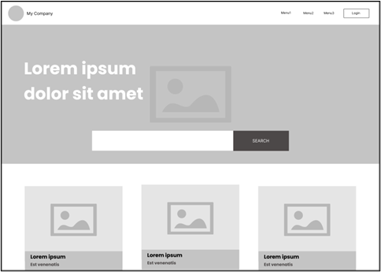
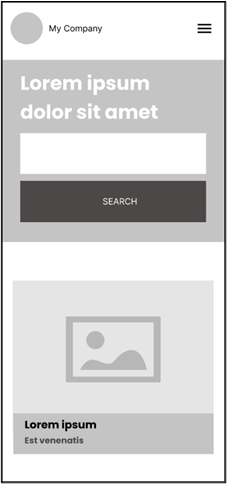

# Mission 0

## The Client
You are contracted by Marketing Association New Zealand to build a quick page as a template for their new digital news home page.

## The Project Brief
You will need to create 1 page with a mobile responsive layout.  Below are the requirements:

- The digital team would like to prototype a solution that resembles the wireframe below.
- Build an application using any front-end framework of your choice with a home page using the wireframe shared as guidance.
- You can use your own color palette and pictures.
- Search functionality need not be implemented.

Make the webpage responsive using the wireframe below as guidance.

 

 

## Help

The following resources may help:

**REQUIRED:** React crash course - [React JS 19 Full Course 2025 | Build an App and Master React in 2 Hours](https://www.youtube.com/watch?v=dCLhUialKPQ)

**RECOMMENDED:** CSS course - [CSS Full Course - Includes Flexbox and CSS Grid Tutorials](https://www.youtube.com/watch?v=ieTHC78giGQ)

**RECOMMENDED:** HTML course - [HTML Full Course - Build a Website Tutorial](https://www.youtube.com/watch?v=pQN-pnXPaVg)